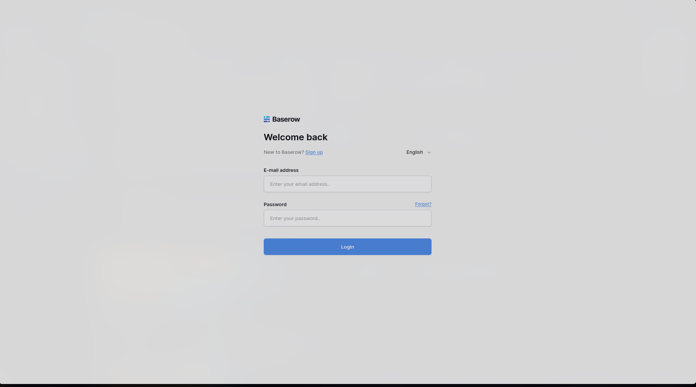
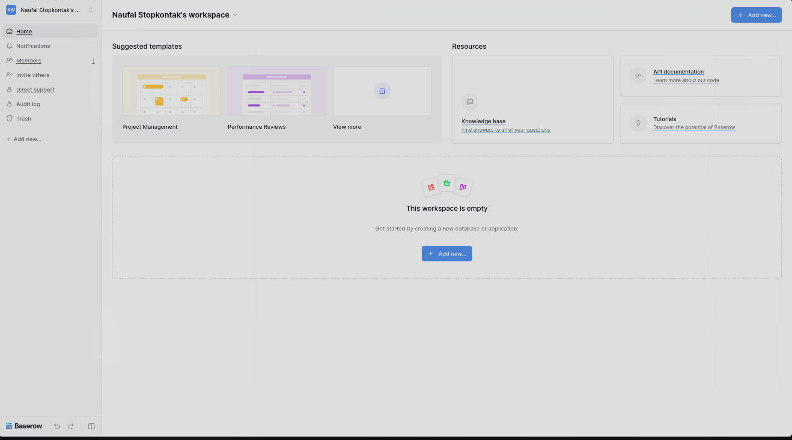
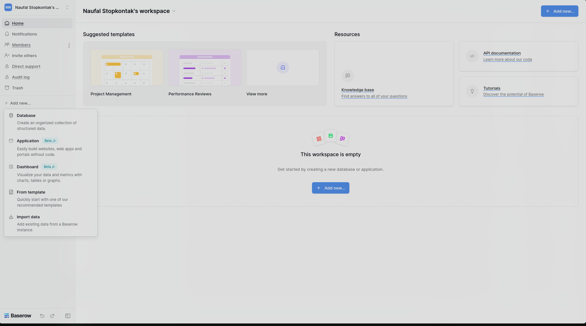
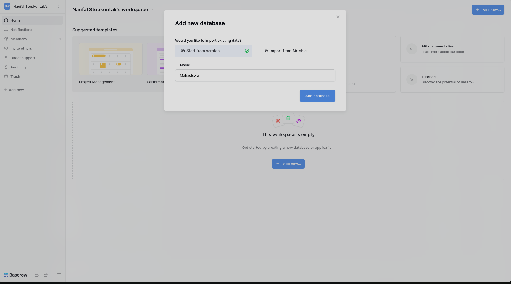
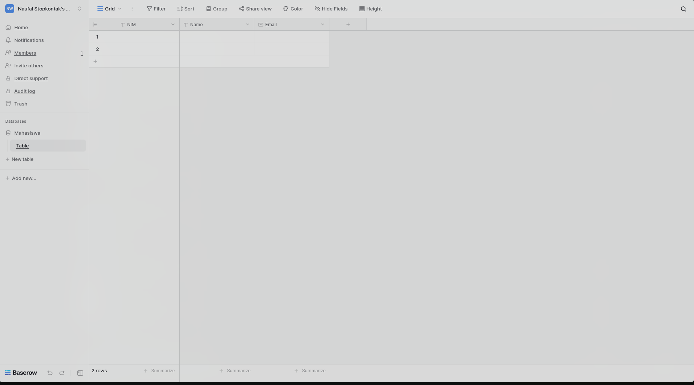
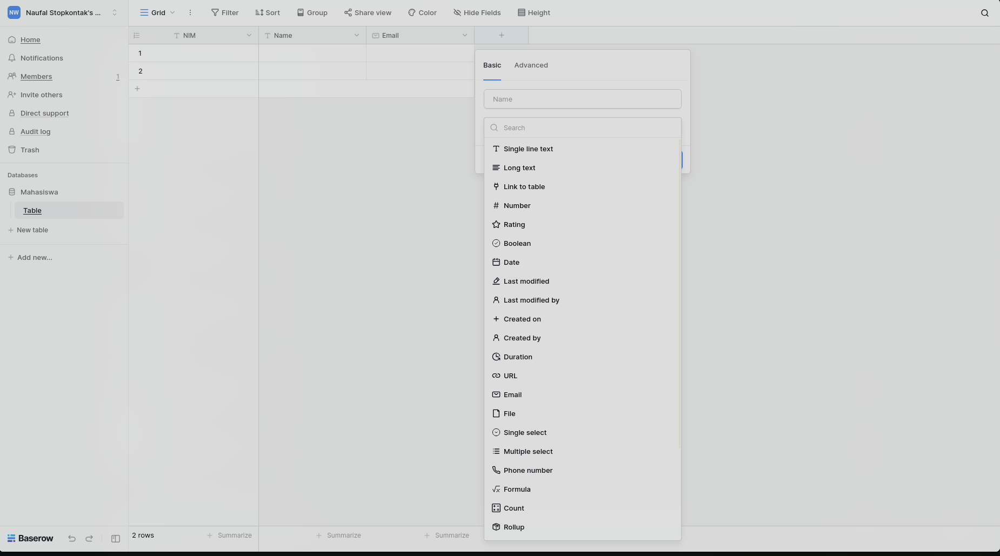
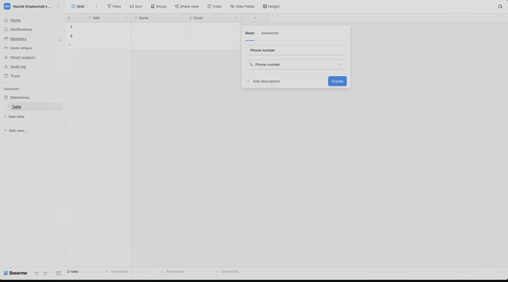
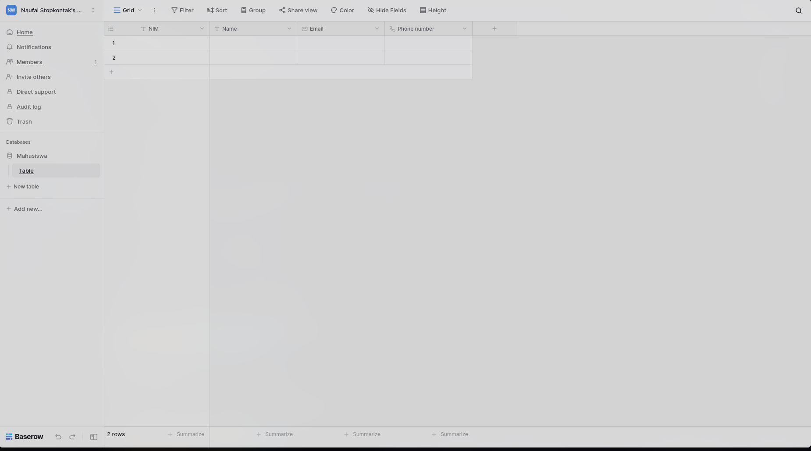

# Aplikasi Baserow

<h1 align="center"></h1>

# Sekilas Tentang

Baserow adalah platform open source no-code database yang memungkinkan pengguna membuat, mengelola, dan berbagi data layaknya Airtable. Ia bisa di-self-hosted, berbasis PostgreSQL, serta menyediakan API untuk integrasi dengan aplikasi lain.

# Instalasi

### Kebutuhan Sistem :
- Unix/Linux, macOS, atau Windows.
- Docker & Docker Compose: Versi terbaru.
- RAM: Minimal 2 GB.
- Penyimpanan: Tergantung jumlah data, disarankan minimal 10 GB kosong.

### Proses Instalasi

# Konfigurasi (opsional)

Setting server tambahan yang diperlukan untuk meningkatkan fungsi dan kinerja aplikasi, misalnya:

- batas upload file
- batas memori
- dll

Plugin untuk fungsi tambahan

- login dengan Google/Facebook
- editor Markdown
- dll

# Maintenance (opsional)

Setting tambahan untuk maintenance secara periodik, misalnya:

- buat backup database tiap pekan
- hapus direktori sampah tiap hari
- dll

# Otomatisasi (opsional)

Skrip shell untuk otomatisasi instalasi, konfigurasi, dan maintenance.

# Cara Pemakaian

- Tampilan aplikasi web
- Fungsi-fungsi utama
- Isi dengan data real/dummy (jangan kosongan) dan sertakan beberapa screenshot

1. Sebelum menggunakan applikasi, kita perlu melakukan login terlebih dahulu.

2. Setelah login berhasil, akan masuk ke halaman home Baserow. Pada menu sidebar terdapat beberapa pilihan yang dapat dilakukan.

3. Fungsi utama pada aplikasi ini adalah mengolah database. Klik add new pada sidebar dan pilih database. 

4. Pilih untuk membuat database baru atau bisa import database. 

5. Setelah itu akan masuk ke halaman dashboard database. Kita bisa menambah tabel pada database, dan bisa mengatur isi dari tabel tersebut. 

6. Tampilan lengkap tabel mahasiswa berisi NIM sebagai primary key, Nama, Email, dan Phone number

# Pembahasan

- Pendapat anda tentang aplikasi web ini
  - kelebihan
  - kekurangan
- Bandingkan dengan aplikasi web lain yang sejenis

# Referensi

1. [Baserow](https://baserow.io/)
2. [Github Baserow](https://github.com/bram2w/baserow)
